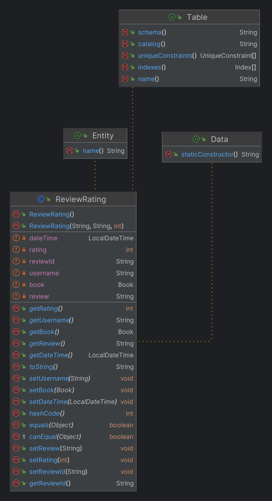

# 📚 Buku.ID

### 📝 Kelas dan Kelompok:
* Pemrograman Lanjut B - B8

### 👤 Developer Team:
* Muhammad Raihan Akbar (2206827674) 🧔🏻‍♂️
* Dimas Herjunodarpito Notoprayitno (2206081282) 🧔🏻‍♂️
* Pradipta Arya Pramudita (2206083685) 🧔🏻‍♂️
* Novrizal Airsyahputra (2206081780) 🧔🏻‍♂️
* Georgina Elena Shinta Dewi Achti (2206810995) 👩🏻

### 💻 Daftar Repositori:

1. BE-Authentication

- Authentication (Register, Login, dan Logout)  (🙋 / 💻) - Raihan

2. BE-Admin

- Dashboard Administrator (💻) - Dimas
- Melihat Pembelian Pelanggan (💻) - Elena
- Mengelola dan Melihat Detail Buku  (🙋 / 💻) - Dimas
- Melihat Keranjang dan Melakukan Checkout  (🙋 / 💻) - Pradipta

3. BE-UserFunctionality

- Landing Page (🙋) - Elena
- Mengelola dan Melihat Detail Buku  (🙋 / 💻) - Dimas
- Melihat Daftar Buku (🙋) - Raihan
- Melihat Keranjang dan Melakukan Checkout  (🙋 / 💻) - Pradipta
- Rating & Review Buku  (🙋) - Novrizal

4. fe-repository
  

---

**Link Canva Diagram:** 
https://www.canva.com/design/DAGGJHFYgN4/Eo3GXgRR50zZWQCt0AkjQQ/edit

--- 
**Review-Rating Diagram**
  
